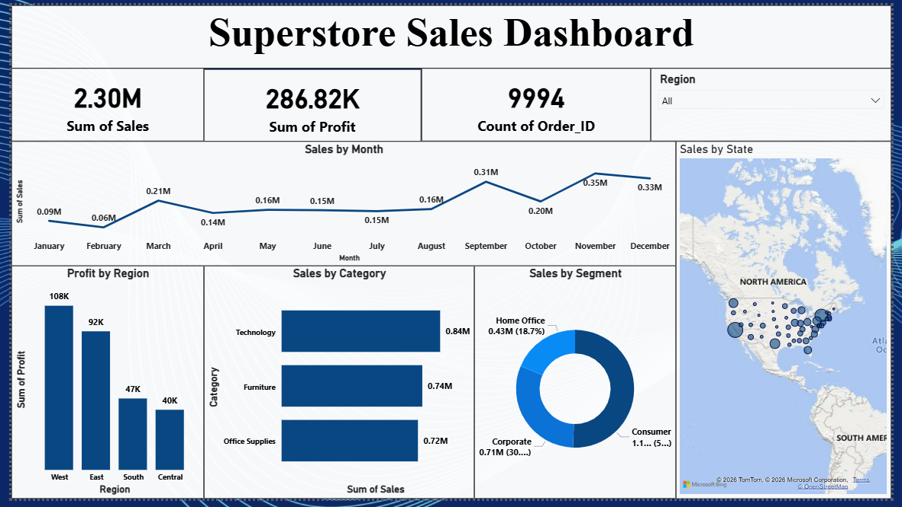

# Superstore Sales Analysis

## Project Overview

This project presents an end-to-end analysis of **9,994 retail transactions** from the Superstore dataset using **Python, SQL, statistical analysis, and Power BI**.

The objective is to evaluate sales performance, profitability, customer behavior, regional performance, product categories, and the impact of discounting on profit.

An interactive Power BI dashboard was developed to convert the analysis into business-focused KPIs and visual insights.

---

## Business Problem

Retail businesses generate revenue across multiple products, customers, regions, and categories, but high sales do not always translate into strong profitability.

The objective of this project is to identify the major drivers of sales and profit, uncover underperforming areas, evaluate discount behavior, and provide insights that can support better commercial decisions.

### Business Questions

The analysis focuses on:

- What are the overall sales and profit levels?
- Which categories generate the highest sales and profit?
- Which regions contribute the most profit?
- Which customer segments generate the most sales?
- Who are the highest-value customers?
- Which products generate significant losses?
- How does discounting relate to profitability?
- How do sales change across months?

---

## Tools & Technologies

| Technology | Purpose |
|---|---|
| Python | Data analysis and exploratory analysis |
| Pandas | Data manipulation |
| NumPy | Numerical analysis |
| Matplotlib | Data visualization |
| Seaborn | Exploratory visualization |
| SQL | Business analysis and KPI calculations |
| Power BI | Interactive dashboard development |
| VS Code | Development environment |
| Git & GitHub | Version control and project documentation |

---

## Dataset Information

The dataset contains **9,994 retail transaction records** across **21 columns**.

It includes information related to:

- Orders and shipping
- Customers and customer segments
- Geographic locations
- Product categories and sub-categories
- Sales
- Quantity
- Discounts
- Profit

### Dataset Summary

| Metric | Value |
|---|---:|
| Total Records | 9,994 |
| Total Columns | 21 |
| Missing Values | 0 |
| Exact Duplicate Rows | 0 |
| Total Sales | ~2.30M |
| Total Profit | ~286.40K |

---

## Data Preparation

Before analysis, the dataset was reviewed for data quality and analytical readiness.

The preparation process included:

- Reviewing dataset dimensions
- Inspecting column names and data types
- Checking for missing values
- Checking for duplicate records
- Reviewing sales, quantity, discount, and profit fields
- Preparing date-related fields for time-based analysis
- Validating categorical fields such as Region, Segment, Category, and Sub-Category

The final dataset contains no missing values or exact duplicate rows.

---

## Exploratory Data Analysis

EDA was performed to understand sales and profitability patterns across important business dimensions.

The analysis focused on:

- Sales and profit performance
- Category and sub-category performance
- Regional profitability
- Customer sales contribution
- Customer segment performance
- Product-level losses
- Discount behavior
- Monthly sales patterns

---

## SQL Business Analysis

SQL was used to calculate business KPIs and answer important analytical questions.

### Analysis Performed

- Total Sales
- Total Profit
- Sales by Category
- Profit by Category
- Top Customers by Sales
- Loss-Making Products
- Regional Profit Analysis
- Customer Sales Ranking
- Average Profit by Discount

### Example SQL

```sql
-- Total Sales
SELECT
    ROUND(SUM(Sales), 2) AS total_sales
FROM [Superstore_final_dataset];


-- Sales by Category
SELECT
    Category,
    ROUND(SUM(Sales), 2) AS total_sales
FROM [Superstore_final_dataset]
GROUP BY Category
ORDER BY total_sales DESC;


-- Regional Profit Analysis
SELECT
    Region,
    ROUND(SUM(Profit), 2) AS total_profit
FROM [Superstore_final_dataset]
GROUP BY Region
ORDER BY total_profit DESC;


-- Customer Sales Ranking
SELECT
    Customer_Name,
    ROUND(SUM(Sales), 2) AS total_sales,
    RANK() OVER (
        ORDER BY SUM(Sales) DESC
    ) AS customer_rank
FROM [Superstore_final_dataset]
GROUP BY Customer_Name;
```

The complete SQL analysis is available in the `SQL` directory.

---

## Power BI Dashboard

An interactive Power BI dashboard was developed to provide an executive view of Superstore sales performance.

### KPI Cards

| KPI | Dashboard Result |
|---|---:|
| Total Sales | 2.30M |
| Total Profit | 286.82K |
| Order/Record Count | 9,994 |

### Dashboard Visualizations

The dashboard includes:

- Sales by Month
- Profit by Region
- Sales by Category
- Sales by Customer Segment
- Sales by State
- Region filter

---

## Dashboard Preview



---

## Key Insights

### Category Performance

**Technology** is the highest-sales category, generating approximately **836K** in sales.

Technology also generates the highest overall category profit.

Furniture generates substantial sales but considerably lower profit compared with Technology and Office Supplies.

### Regional Performance

The **West region** generates the highest profit at approximately **108K**, followed by the East region.

The Central region generates the lowest overall regional profit.

### Customer Segments

The **Consumer segment** generates the highest sales, contributing approximately **1.16M**.

Corporate customers contribute approximately **706K**, while Home Office customers contribute approximately **430K**.

### Discount and Profitability

The analysis indicates that higher discount levels can be associated with weaker average profitability.

Aggressive discounting should therefore be evaluated carefully rather than being used solely to increase sales volume.

### Monthly Sales

Sales fluctuate across the year, with stronger sales visible toward the later months in the dashboard.

Understanding these patterns can support inventory, promotion, and sales planning.

---

## Business Recommendations

Based on the analysis:

1. **Prioritize profitable categories**  
   Technology combines strong sales with strong profitability and should remain an important commercial focus.

2. **Investigate Furniture profitability**  
   Furniture generates substantial sales but relatively weak overall profit, suggesting a need to examine product margins, discounting, and loss-making items.

3. **Review discount strategy**  
   High discount levels should be evaluated against resulting profit rather than sales alone.

4. **Investigate loss-making products**  
   Products generating repeated losses should be reviewed for pricing, discount, shipping, or assortment decisions.

5. **Leverage high-value customer segments**  
   Consumer customers generate the largest sales contribution and represent an important segment for retention and targeted campaigns.

6. **Use regional performance for planning**  
   Practices contributing to stronger profitability in the West and East regions can be investigated for potential application in weaker regions.

---

## Project Structure

```text
superstore-sales-analysis/
│
├── Data/
│   └── Superstore_final_dataset.csv
│
├── Notebooks/
│   └── Python analysis and EDA
│
├── SQL/
│   └── SQL business analysis
│
├── dashboard/
│   └── Power BI dashboard
│
├── screenshots/
│   └── Dashboard screenshot
│
├── requirements.txt
│
└── README.md
```

---

## How to Reproduce the Project

1. Clone or download the repository.
2. Load the Superstore dataset from the `Data` directory.
3. Install the Python dependencies from `requirements.txt`.
4. Run the notebook from the `Notebooks` directory.
5. Execute the business analysis queries from the `SQL` directory.
6. Open the Power BI file from the `dashboard` directory.
7. Validate the dashboard KPIs against the source dataset.

---

## Key Learnings

This project demonstrates practical experience with:

- Retail sales analytics
- Data quality validation
- Exploratory Data Analysis
- SQL aggregation and business analysis
- SQL window functions
- Customer and product analysis
- Profitability analysis
- Discount analysis
- Power BI dashboard development
- Translating analytical results into business recommendations

---

## Author

**Tushar Sharma**

Data Analyst | SQL | Python | Power BI | Tableau | AWS | Snowflake

GitHub: `imtusharsharma-45`
